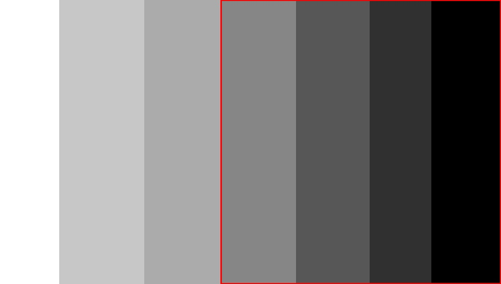
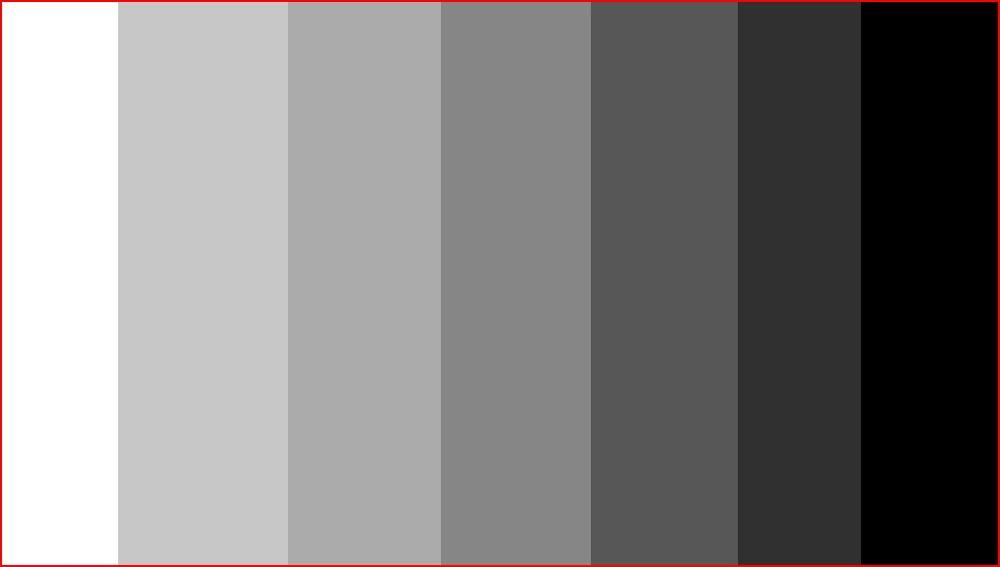
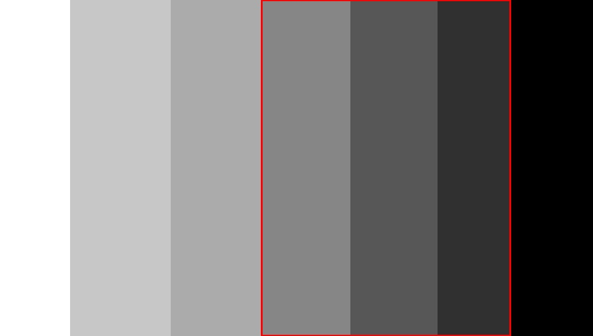
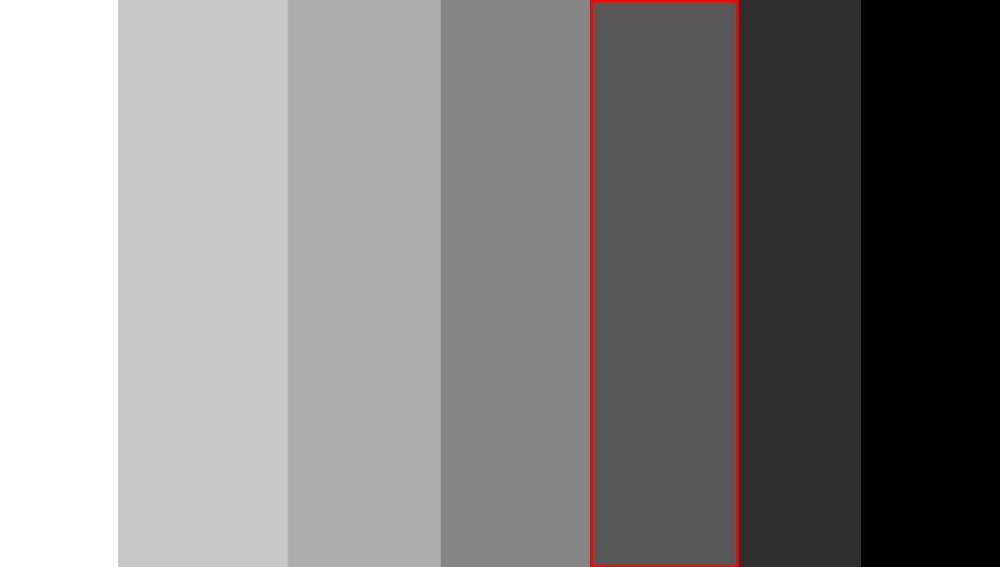
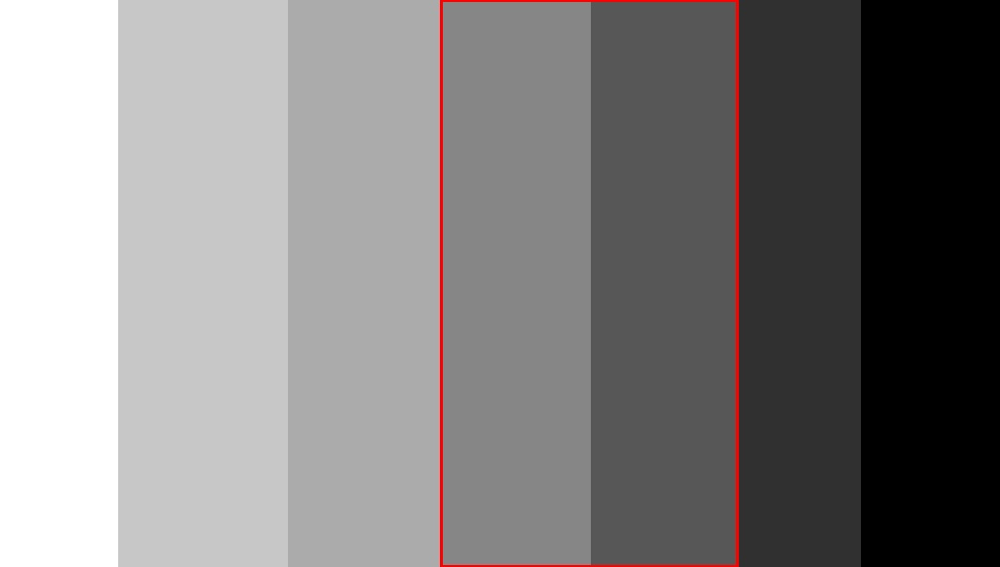

## WindowCeator.py
Verilen alt ve üst limit bilgilerine göre pencere açılmasını sağlayan fonksiyon
```
def WindowCeator(lowerLimit, upperLimit, img):
    windowName = f'threshold between {lowerLimit} and {upperLimit}'
    cv2.namedWindow(windowName)    
    cv2.imshow(windowName, img)
```

## thresholdIntersection.py
Verilen alt ve üst limit bilgilerini alır.
- thresholdLower değişkeni verilen alt limit'ten 0'a kadar olan tüm piksel değerlerini 255 ile değiştirilmiş halini saklar.
- thresholdUpper değişkeni verilen üst limit değişkeni ile 255 arasındaki tüm değerleri 255 değeri ile değiştirir.
- Daha sonra numpy kütüphanesini kullanarak bu threshold değerlerinin olduğu matrisler birleştirilir.
- Kısacası önce 0-alt limit arası değerler daha sonra da üst limit-255 arasında kalan değerler 0 atandıktan sonra birleştirilir ve geriye sadece alt-üst limit arasındaki 
değerler kalmış olur
-*0 piksellik alanları bulabilmek için -1 verilmesi gerekiyor!!*
```
def thresholdIntersection(image, grayImage, lowerLimit, upperLimit):
    _,  thresholdLower = cv2.threshold(grayImage, lowerLimit, 255, cv2.THRESH_BINARY_INV)
    _, thresholdUpper = cv2.threshold( grayImage, upperLimit, 255, cv2.THRESH_BINARY)


    # And by summing these threshold values, I change every pixel value to 255, except for 
    # the lower and upper limit range, so that the intermediate region remains.    
    nestedImage = np.add(thresholdLower, thresholdUpper)    
    _,threshold_Nested = cv2.threshold(nestedImage, 0, 255, cv2.THRESH_BINARY_INV)
    nestedContours, _ = cv2.findContours(threshold_Nested, cv2.RETR_TREE, cv2.CHAIN_APPROX_SIMPLE)


    cv2.drawContours(image, nestedContours, -1, (0, 0, 255), 2)
    cv2.imwrite(f"images/results/{lowerLimit}_to_{upperLimit}.jpg", image)
    return image
```
# Örnekler

## -1_to_150.jpg


## -1_to_255.jpg.jpg


## 0_to_255.jpg.jpg


## 30_to_150.jpg.jpg.jpg


## 50_to_100.jpg.jpg.jpg


## 50_to_150.jpg.jpg.jpg

