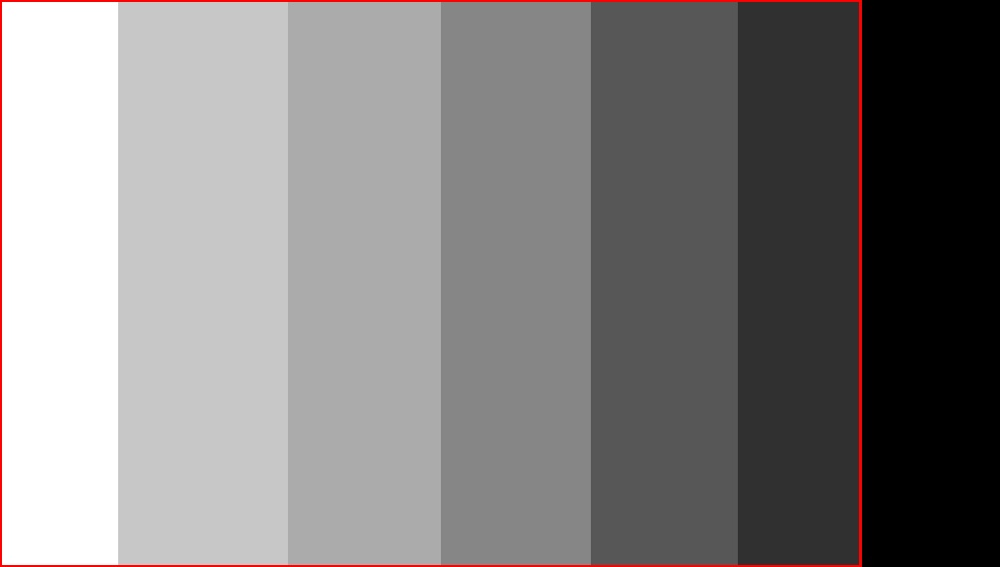

## thresholdIntersection.py

The `thresholdIntersection` function takes the lower and upper limit information as inputs and performs the following steps:

1. Calculates the `thresholdLower` variable by applying an inverted binary threshold to the `grayImage`, replacing all pixel values from the lower limit to -1 with 255.
2. Calculates the `thresholdUpper` variable by applying a binary threshold to the `grayImage`, replacing all pixel values from the upper limit to 255 with 255.
3. Uses NumPy to combine these thresholded images into a single matrix called `nestedImage`.
4. Applies an inverted binary threshold to the `nestedImage`, replacing all values from 0 to 255 with 255 and storing the result in `threshold_Nested`.
5. Finds the contours in the `threshold_Nested` image using `cv2.findContours`.
6. Draws the contours on the image using `cv2.drawContours`.
8. Returns the modified image.


The `thresholdIntersection` function takes the lower and upper limit information as inputs and performs the following steps:

```python
def thresholdIntersection(image, grayImage, lowerLimit, upperLimit):
    """
    Apply threshold intersection to an image.

    Args:
        image (numpy.ndarray): The original image.
        grayImage (numpy.ndarray): The grayscale version of the original image.
        lowerLimit (int): The lower limit for thresholding.
        upperLimit (int): The upper limit for thresholding.

    Returns:
        numpy.ndarray: The modified image with contours drawn.

    """
    # Apply inverted binary threshold to grayImage based on lowerLimit
    thresholdLower = cv2.threshold(grayImage, lowerLimit, 255, cv2.THRESH_BINARY_INV)[1]

    # Apply binary threshold to grayImage based on upperLimit
    thresholdUpper = cv2.threshold(grayImage, upperLimit, 255, cv2.THRESH_BINARY)[1]

    # Combine the thresholded images by adding them together
    nestedImage = cv2.add(thresholdLower, thresholdUpper)

    # Apply inverted binary threshold to nestedImage to create final thresholded image
    thresholdNested = cv2.threshold(nestedImage, 0, 255, cv2.THRESH_BINARY_INV)[1]

    # Find contours in the thresholded image
    nestedContours, _ = cv2.findContours(thresholdNested, cv2.RETR_TREE, cv2.CHAIN_APPROX_SIMPLE)

    # Draw the contours on the original image
    cv2.drawContours(image, nestedContours, -1, (0, 0, 255), 2)

    # Return the modified image with contours
    return image

```

## Usage

```
import cv2
import numpy as np

# Load image
image = cv2.imread('input.jpg')

# Convert image to grayscale
grayImage = cv2.cvtColor(image, cv2.COLOR_BGR2GRAY)

lowerLimit = -1
upperLimit = 255
windowName =f'threshold between {lowerLimit} and {upperLimit}'

#this func creating a function according to out parameters
nestedImage , contours = thresholdIntersection(imgBase, grayImage, lowerLimit, upperLimit)

# Draw the contours on the original image
cv2.drawContours(nestedImage, contours, -1, (0, 0, 255), 2)

cv2.namedWindow(windowName)    
cv2.imshow(windowName, nestedImage)
cv2.waitKey(0) 
cv2.destroyAllWindows()

```

# Outputs

## -1_to_150.jpg


## -1_to_255.jpg


## 0_to_255.jpg


## 30_to_150.jpg


## 50_to_100.jpg


## 50_to_150.jpg


## Dependencies

The project requires the following dependencies:

- OpenCV
- NumPy

Please make sure to install these dependencies before running the project.

## License

This project is licensed under the MIT License.

Feel free to modify and use the code according to your needs. Contributions are also welcome!

Please note that you might need to adjust the image paths and directory structure to match your own project setup.
